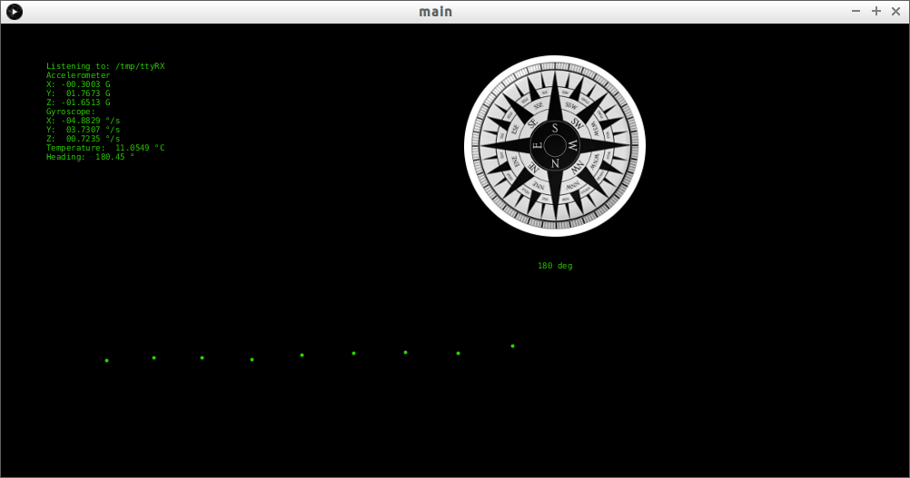

# Setup

Add the following lines to your `.bashrc` file so then you should be able to call the command `processing-java` 
from the command line.
```
# path to the processing-java binary
export PATH=$PATH:/YOUR/PATH/TO/processing-3.0.1
```

# Simulator

This board simulator is written in python 2.7 and involves serial communication, spawning of a sub-process, scheduling of a recurring operation.

The serial port creation/mapping is done with `socat` e.g.:
```
$ socat -d -d pty,raw,echo=0,link=/tmp/ttyRX pty,raw,echo=0,link=/tmp/ttyTX
```
Where `/tmp/ttTX` is the __virtual serial port__ where the simulator writes data regarding the Arduino UNO board and `/tmp/ttRX` is the port where the Processing dashboard is reading the data.

Run the simulator from the command line like:
```
$ ./boardValuesSimulator.py
```

To check what is being written on the serial port use `screen` like:
```
$ screen /tmp/ttyRX 9600
```

# The dashboard

When the Processing dashboard does not find any real board printing data on a USB serial port, then it assumes
there's a simulator running and printing data on `/tmp/ttyRX`.

## Build

Run the bash script `buil-processing.sh`. It should generate the java code and bytecode inside the folder `bytecode-out`
and run the java process for that bytecode.

In the picture below you can see:

 - a summary of all the (parsed) sensor measurements (accelerometer, gyroscope, magnetometer, temperature);
 - a compass pointing to the magnetic north;
 - a series of dots representing a (really really) basic temperature graph :)

I should be organising this dashboard with more details, but for now this is it.


The compass has been copied from the great work done by jarzebski on his [repository](https://github.com/jarzebski/Arduino-HMC5883L).
