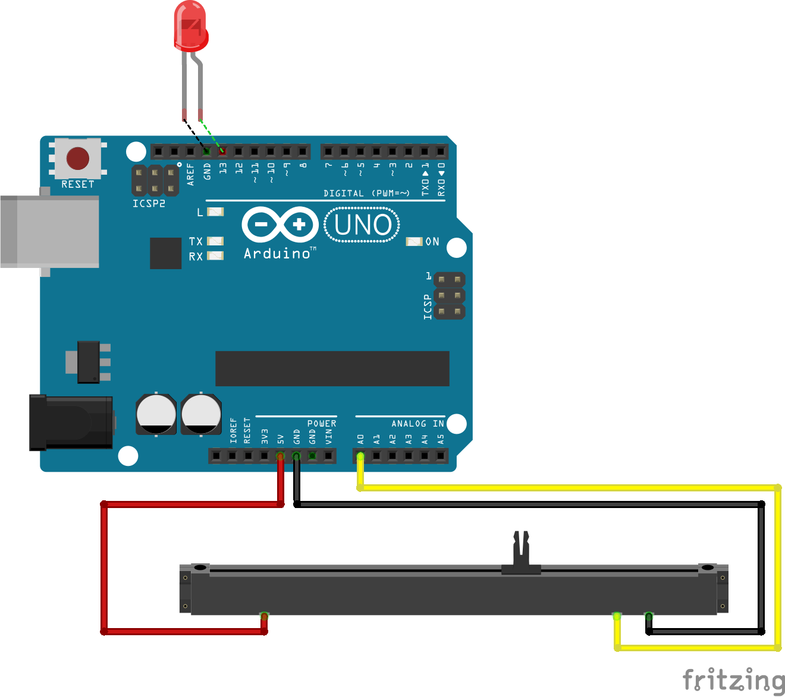
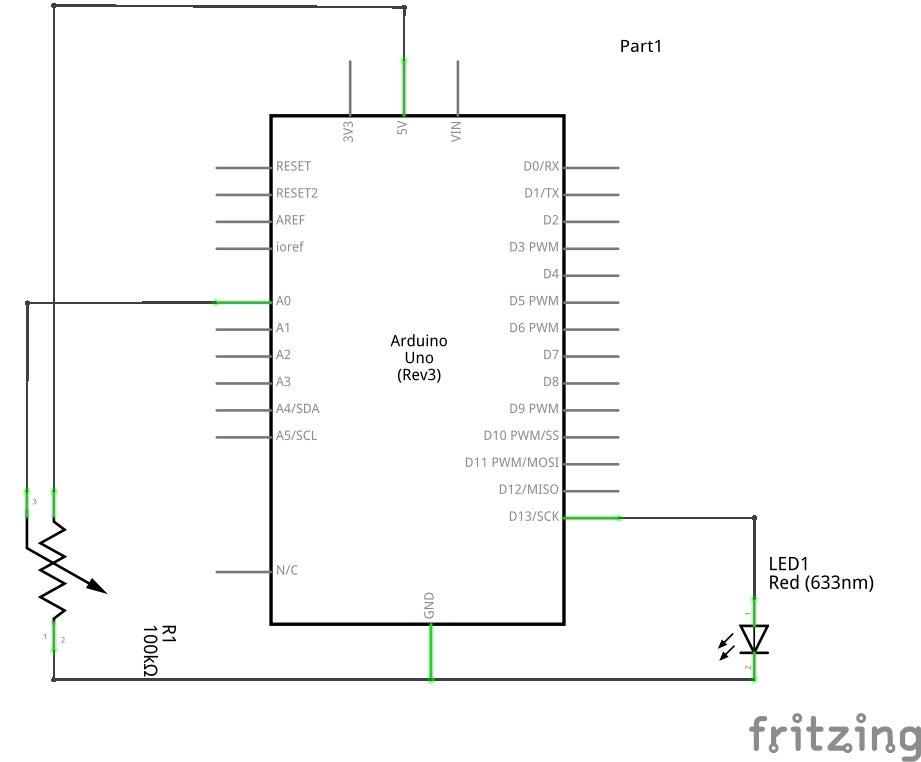
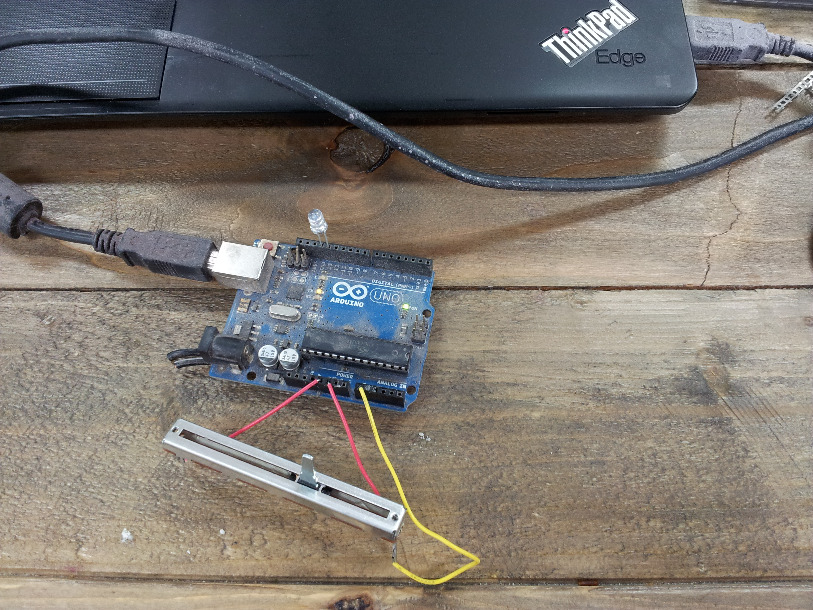

# Slider & LED

This small IoT project (Internet Of Things) shows how to switch on/off a LED by evaluating the signal of a slider used as a commander.

## Hardware

You need:
- __Arduino Uno R3__;
- __LED__ on the pins `GND` and `13`;
- __slider__ on the pins `A0` (the signal) and the couple `5V` and `GND` for the power supply.

The slider I've been using is a `Bourns Inc. PTA6043-2015DPB103 POTENTIOMETER, SLIDE, 10K, 20%, 0.25W`. From the datasheet you could find out:
- Pin 2: the slide gang;
- Pin 1, 3: GND and 5V.

You can find the PDF datasheet here at the [Bourns website](http://www.bourns.com/data/global/pdfs/pta.pdf). 

## Software

The source code is written in javascript for the __Node.js__ platform. The main library is [Johnny-Five](http://johnny-five.io).

To get started you need:
* The Arduino IDE running the __Firmata__ package (File -> Example -> Firmata -> StandardFirmata);
* Check that the Arduino board is properly __connected via USB__ to your computer (under linux run `lsusb | grep Arduino` on the command line to check the board is connected and running);
* Select the Arduino UNO board from the IDE (Tools -> Board -> Arduino UNO);
* Select the COM port from the IDE (Tools -> Serial Port -> /dev/ttyACM0);
* Upload the Firmata source code to the board via the Arduino IDE clicking on the Upload button.

At this point the Node.js code running on your laptop (basically the Johnny-Five __npm__ module) will use the Firmata code running on the board as an API.

From the command line you should be able to run the source code using the `node` command:
```
$ node slider-with-led.js 
1435411275762 Device(s) /dev/ttyACM0 
1435411275780 Connected /dev/ttyACM0 
1435411279120 Repl Initialized 
>> off: 0.39100684261974583
on: 0.5865102639296188
on: 0.6842619745845552
on: 0.5865102639296188
on: 0.6842619745845552
on: 0.8797653958944281
on: 0.6842619745845552
on: 0.6842619745845552
off: 0.2932551319648094

(^C again to quit)
>> 
1435411290860 Board Closing. 
$
```

## Images

The schematic and the breadboard schema have been generated using __Fritzing__ (you can load the `.fzz` file from the `doc` folder).

### The breadboard schema


### The schematic


### The real example



# Acknowledgment

A big thank you to the guys of the [NodeBots of London meetup](http://www.meetup.com/NodeBots-of-London) for organising the hacklab I've been to in June 2015.