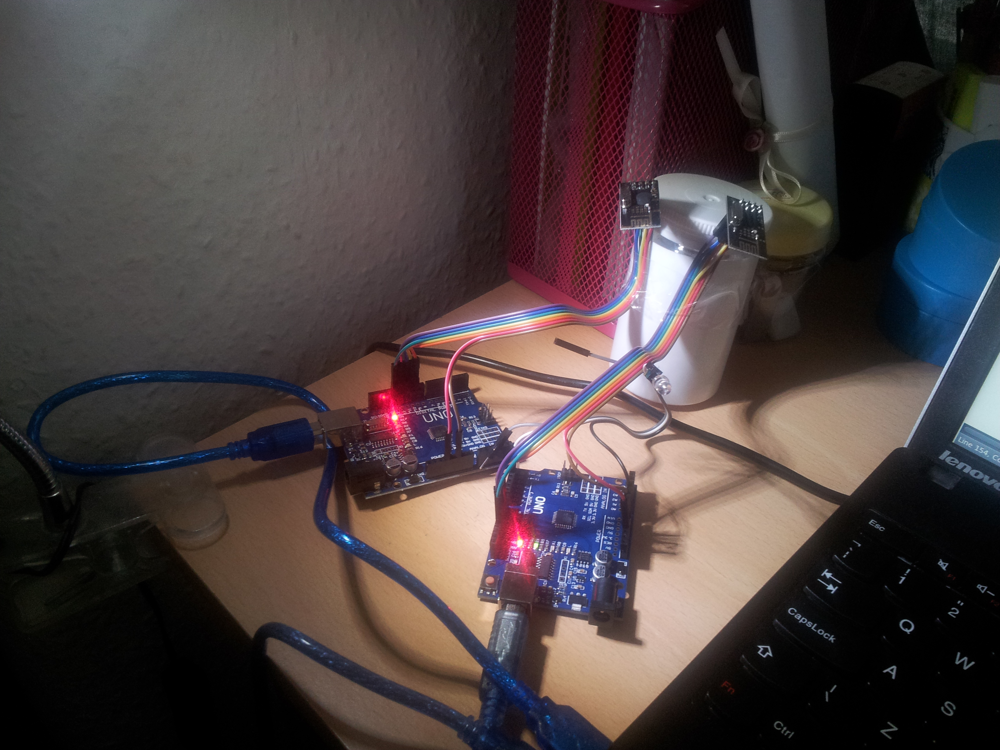
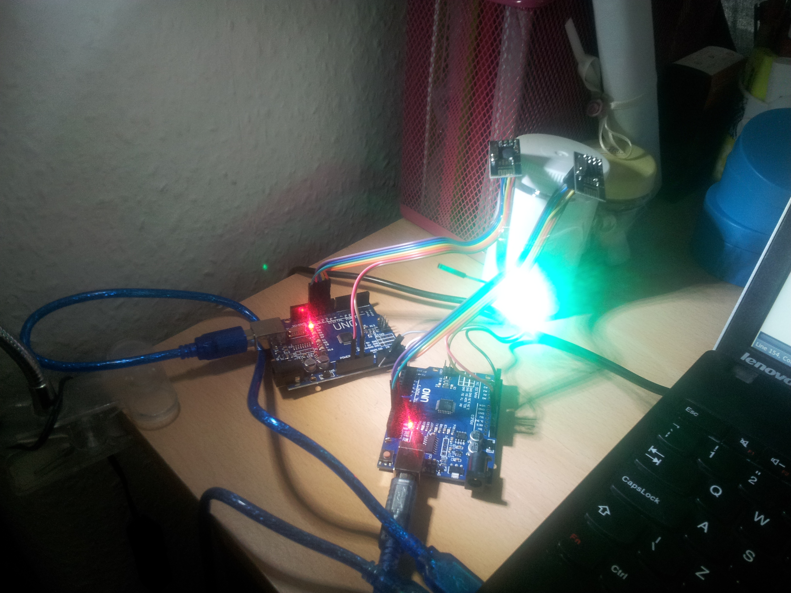
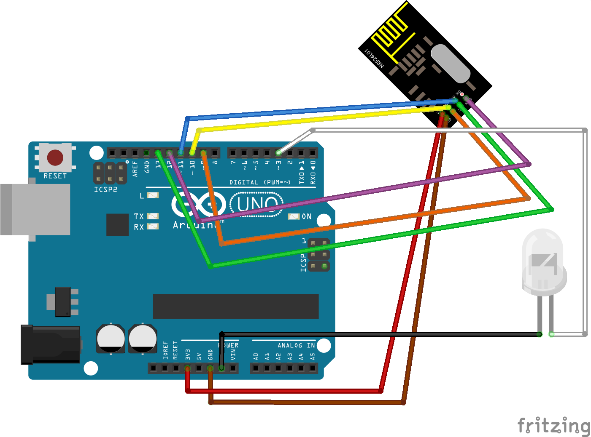

Transmitter / Receiver project
==============================

This little project aims at showing a minimum working example of transmitter / receiver interaction.

## Hardware setup

For the transmitter you need:
 - 1 Arduino UNO board.
 - 1 nRF24L01+ data transceiver module.
 - 7 jumper wires male-female to connect the radio module to the board.
 - 1 USB cable to connect the board to your computer.

For the receiver you need:
 - 1 Arduino UNO board.
 - 1 nRF24L01+ data transceiver module.
 - 7 jumper wires male-female to connect the radio module to the board.
 - 1 LED (I used a green one).
 - 2 jumper wires male-female to connect the LED to the board.
 - 1 USB cable to connect the board to your computer.

In the following picture you can see the 2 boards. The transmitter is on the left, the receiver is on the right. Both of them have their transceiver attached to them using the jumper wires. (Ignore that gray jumper wire attached to the LED, that's there but not used, only the white and black wires are used for that LED).


When the receiver finds some data sent by the transmitter then it switches on the green LED (cfr. the source code).
You should see also the transmitter board blinking a LED when transmitting. I think this is because of the R24 library, but I did not check out their source code yet.


### Pin wiring

| Arduino pin | Wire colour | Transceiver signal | Transceiver pin  |
|-------------|-------------|--------------------|------------------|
| GND         | Brown       | GND                | 1                |
| 3.3V        | Red         | VCC                | 2                |
| 9           | Orange      | CE                 | 3                |
| 10          | Yellow      | CSN                | 4                |
| 13          | Green       | SCK                | 5                |
| 11          | Blue        | MOSI               | 6                |
| 12          | Violet      | MISO               | 7                |
| (2)         | (Gray)      | (IRQ)              | (8)              |

 - The `IRQ` pin is not currently used, but I've found it documented in many places so I've added it to the table.
 - The green LED needs to be wired to the Arduino UNO board pins 3 (digital 3) and GND (ground).

In the following schematic you can see the __receiver__ setup. Regarding the __transmitter__ setup it's almost the same, just ignore the part regarding the green LED.
 


## Software lifecycle

I've decided to use `platformIO` rather than the Arduino IDE. It's a dependency management tool similar to maven for Java or npm for node.js, I found this useful because the RF24 library is a dependency for both the transmitter and the receiver modules. You can check their documentation at:

- Getting started guide: [http://docs.platformio.org/en/latest/quickstart.html](http://docs.platformio.org/en/latest/quickstart.html)
- Dealing with libraries (dependencies): [http://docs.platformio.org/en/latest/projectconf.html#lib-install](http://docs.platformio.org/en/latest/projectconf.html#lib-install)

To initialise a project using an Arduino UNO board:
```
$ platformio init --board=uno
```

If you dont' have all the flashing tools installed yet, then `platformIO` installs also:
 - toolchain-atmelavr 
 - tool-avrdude package
 - framework-arduinoavr
 - tool-micronucleus package

### Checking the USB / serial ports

When plugging in the __transmitter (tx)__:

```
$ lsusb | grep USB
Bus 003 Device 084: ID 1a86:7523 QinHeng Electronics HL-340 USB-Serial adapter
$ ls -l /dev/ttyUS*
crw-rw---- 1 root dialout 188, 0 Oct 24 11:25 /dev/ttyUSB0
```

When plugging in the __receiver (rx)__ then you should see also the previously plugged in transmitter:

```
$ lsusb | grep USB
Bus 003 Device 085: ID 1a86:7523 QinHeng Electronics HL-340 USB-Serial adapter
Bus 003 Device 084: ID 1a86:7523 QinHeng Electronics HL-340 USB-Serial adapter
$ ls -l /dev/ttyUS*
crw-rw---- 1 root dialout 188, 0 Oct 24 11:25 /dev/ttyUSB0
crw-rw---- 1 root dialout 188, 1 Oct 24 11:28 /dev/ttyUSB1
```

Using `platformIO` you should get the information regarding the ports to use when uploading the firmware:

```
$ platformio serialports list

[...]

/dev/ttyUSB1
------------
Hardware ID: USB VID:PID=1a86:7523
Description: QinHeng Electronics HL-340 USB-Serial adapter 

/dev/ttyUSB0
------------
Hardware ID: USB VID:PID=1a86:7523
Description: QinHeng Electronics HL-340 USB-Serial adapter
```

To monitor those serial ports you could use `screen` (e.g. `screen /dev/ttyUSB0 9600`), but also `platformio` itself (default baud rate 9600, otherwise use the `--baud` option).

For the transmitter (the first one I plugged in):
```
$ platformio serialports monitor --port /dev/ttyUSB0
```
For the receiver (the second one I plugged in):
```
$ platformio serialports monitor --port /dev/ttyUSB1
```

### Compiling the code, then uploading the firmware

#### For the transmitter project

```
$ platformio run
$ platformio run --target upload --upload-port /dev/ttyUSB0
```

Then quickly open the serial port reader and you should be able to see this overview:
```
$ platformio serialports monitor --port /dev/ttyUSB0
--- Miniterm on /dev/ttyUSB0: 9600,8,N,1 ---
--- Quit: Ctrl+]  |  Menu: Ctrl+T | Help: Ctrl+T followed by Ctrl+H ---
STATUS		 = 0x0e RX_DR=0 TX_DS=0 MAX_RT=0 RX_P_NO=7 TX_FULL=0
RX_ADDR_P0-1	 = 0xe8e8f0f0e1 0xc2c2c2c2c2
RX_ADDR_P2-5	 = 0xc3 0xc4 0xc5 0xc6
TX_ADDR		 = 0xe8e8f0f0e1
RX_PW_P0-6	 = 0x20 0x00 0x00 0x00 0x00 0x00
EN_AA		 = 0x3f
EN_RXADDR	 = 0x03
RF_CH		 = 0x4c
RF_SETUP	 = 0x07
CONFIG		 = 0x0e
DYNPD/FEATURE	 = 0x00 0x00
Data Rate	 = 1MBPS
Model		 = nRF24L01+
CRC Length	 = 16 bits
PA Power	 = PA_MAX
Transmitted: 111
Transmitted: 111

[...]
```

#### For the receiver project

Compile the code and upload the firmware:
```
$ platformio run --target upload --upload-port /dev/ttyUSB1
```

Then you can check what's being printed in the serial port:

```
$ platformio serialports monitor --port /dev/ttyUSB1
--- Miniterm on /dev/ttyUSB1: 9600,8,N,1 ---
--- Quit: Ctrl+]  |  Menu: Ctrl+T | Help: Ctrl+T followed by Ctrl+H ---
No radio available
No radio available
No radio available
[...]
No radio available
No radio available
Received this message: 111
No radio available
No radio available
No radio available
[...]
```

You should see the __LED switched on__ every time the receiver parses a message.


To clean the project folder from the compiled code:

```
$ platformio run --target clean
```

For more details check the `platformIO` run command [documentation](http://docs.platformio.org/en/latest/userguide/cmd_run.html).


## Other resources

Some useful links with documentation and video / blog tutorials:

| Arduino Serial Port reference (Serial Peripheral Interface - SPI) | https://www.arduino.cc/en/Reference/SPI |
| About the Nordic nRF24L01+ and the RF24 C++ library:              | https://arduino-info.wikispaces.com/Nrf24L01-2.4GHz-HowTo |
|                                                                   | http://www.instructables.com/id/Wireless-Remote-Using-24-Ghz-NRF24L01-Simple-Tutor/?ALLSTEPS |
|                                                                   | http://shanes.net/another-nrf24l01-sketch-string-sendreceive |
| Documentation and examples for the RF24 library:                  | http://tmrh20.github.io/RF24 |
|                                                                   | https://github.com/TMRh20/RF24 |
| The datasheet of the radio module                                 | http://www.nordicsemi.com/eng/Products/2.4GHz-RF/nRF24L01P |
| Getting Started with the nRF24L01 Transceiver                     | https://www.youtube.com/watch?v=BjId_6tlYvE |
|                                                                   | http://forcetronic.blogspot.co.uk/2015/02/getting-started-with-nrf24l01.html |
| 1-Day Project: Arduino and nRF24L01+ Data Transceiver             | https://www.youtube.com/watch?v=wlhuO82IZjQ |
| Fritzing schematics for the transceiver                           | http://shanes.net/nrf24l01-fritzing-part
|                                                                   | http://shanes.net/wp-content/uploads/NRF24L01.zip |

